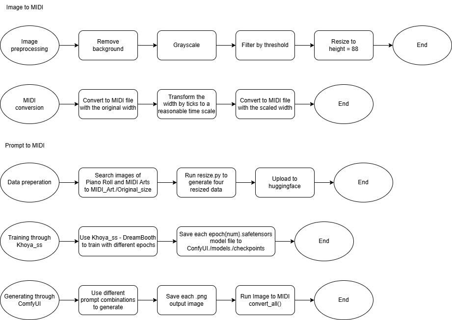
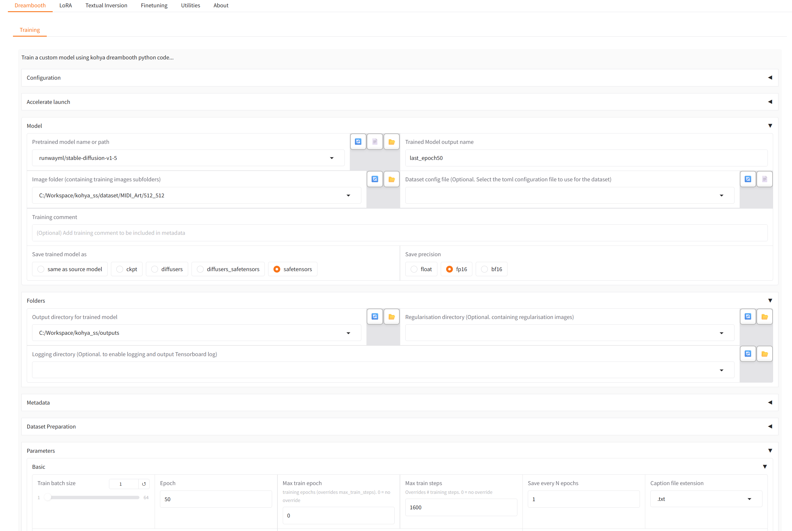
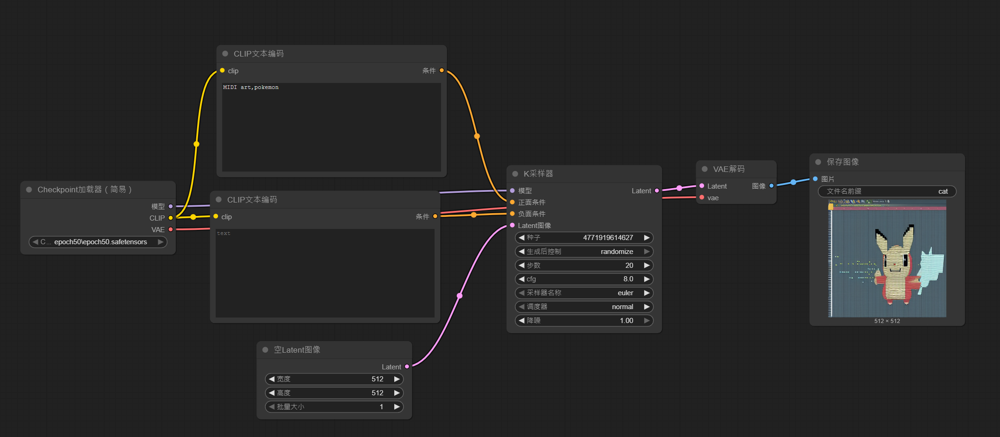

# MIDI-Art-Generator
Generate MIDI art by user's prompts or images.

## Workflows


## Image to MIDI
- Run [image_to_midi.py](image_to_midi.py) .
- You should put your target images into a folder "Inputs" under the current project path.

## Prompt ot MIDI
### Datasets
- Self-labeled dataset: [MIDI_Art](https://huggingface.co/datasets/LunaticGhoulPiano/MIDI_Art)
```
MIDI_Art
├──data_source.md
├──Original_size
|  ├──MIDIArt
|  |  ├──1.jpg
|  |  ├──1.txt
|  |  ...
|  |  ├──25.jpg
|  |  └──25.txt
|  └──PianoRoll
|     ├──1.jpg
|     ├──1.txt
|     ...
|     ├──15.jpg
|     └──15.txt
├──512_512
├──512_768
├──768_512
└──768_768
...
```

### Structure of ComfyUI
```
ComfyUI
├──models
|  ├──checkpoints
|  ...├──epoch1
|     └──epoch1.safetensors
|     ├──epoch3
|     |  └──epoch3.safetensors
|     ├──epoch10
|     |  └──epoch10.safetensors
|     ├──epoch30
|     |  └──epoch30.safetensors
|     ├──epoch50
|     ...└──epoch50.safetensors
├──output
|  ├──output
|  |  ├──Cat_1_epoch_1_{serial number}.png
|  |  ...
|  ...
...
```

### Training by different epochs

- Platform: [Khoya_ss](https://github.com/bmaltais/kohya_ss) - Dreambooth
- Base model: ```stable-diffusion-v1-5```
- Dataset: 512_512
- Test epochs: 1, 3, 10, 30, 50
- Other settings:
    - Model file extension: ```.safetensors```
    - Save precision: ```fp16```
    - Others remain as default

### Experiments with ComfyUI
- Used data size: 512 * 512
#### Test "type"s
- See [Manual](./Manual/) .
1. ```Cat.png```: https://youtu.be/0NxggcQ5ffU?si=jEfkmX2EJFgVcjxl
2. ```Crocodile.png```: https://youtu.be/jUqHf-OL9Qw?si=KmRY_Rl-O0Xu-dqI
3. ```Charmander.jpg```: https://www.pingwest.com/a/107918
4. ```Adidas.png```: https://youtu.be/22X7Ic6eWnk?si=lUtIJFu1RRZIFsRC
#### Workflow
- See [workflow_ComfyUI.json](workflow_ComfyUI.json).

- Each type has 3 level of prompts (see [prompts.json](prompts.json)):
    1. Minimum
    2. Detail
    3. Detail + musical requirements
- Pseudo code:
    ```python
    from main import convert_all
    # Suppose current directory is ./Documents./ComfyUI
    workflow = read_workflow_json("./workflow_ComfyUI.json")
    for model in checkpoints: # epoch1, epoch3, epoch10 ,epoch30, epoch50
        for test_type in test_types: # Cat, Crocodile, Pikachu, Adidas
            for prompt in prompts: # "1", "2", "3"
                cur = workflow.deepcopy()
                load_settings(cur, model, test_type, prompt)
                img = call_ComfyUI_api(cur)
                save_image(img, save_path)
    
    convert_all(save_path, "./output")
    ```